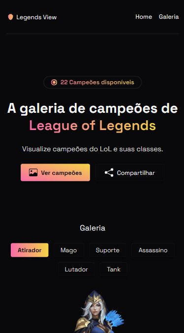

<div align="center">
  <h1>🛡️ Legends View</h1>
  <p>Uma galeria dos campeões de League of Legends.</p>
  
  
  
  
  
  
</div>

## Sumário

- [Sobre](#about)
- [Preview](#preview)
- [Tecnologias](#built-with)
- [Funcionalidades](#key-features)
- [Deploy](#deploy)
- [Destaques](#highlights)
- [Meu contato](#contact)

<h2 id="about">Sobre</h2>


Uma aplicação que permite visualizar as classes e os campeões de League of Legends.

<h2 id="preview">Preview</h2>

Desktop


Mobile



<h2 id="built-with">Tecnologias</h2>

- JavaScript
- HTML
- CSS

<h2 id="key-features">Funcionalidades</h2>

- [x] Selecionar classe
- [x] Selecionar campeão
- [x] Compartilhar aplicação

<h2 id="deploy">Deploy</h2>

Acesse o Legends View no link abaixo

[Legends View](https://udanielnogueira.github.io/legends-view/)

<h2 id="highlights">Destaques</h2>

Criação de uma base de dados em JS.

```js
let atiradores = [
  {
    nome: 'Ashe',
    classe: ['atirador, suporte'],
    src: './assets/img/champions/ashe.png',
    bio: 'A Arqueira do Gelo, Ashe',
  },
  {
    nome: 'Ezreal',
    classe: ['atirador', 'mago'],
    src: './assets/img/champions/ezreal.png',
    bio: 'O Explorador Pródigo, Ezreal',
  },
  {
    nome: 'Jayce',
    classe: ['atirador', 'lutador'],
    src: './assets/img/champions/jayce.png',
    bio: 'O Defensor do Amanhã, Jayce',
  },
  {
    nome: 'Jinx',
    classe: ['atirador'],
    src: './assets/img/champions/jinx.png',
    bio: 'O Gatilho Desenfreado, Jinx',
  },
  {
    nome: 'Lucian',
    classe: ['atirador, assassino'],
    src: './assets/img/champions/lucian.png',
    bio: 'O Purificador, Lucian',
  },
  {
    nome: 'Senna',
    classe: ['atirador', 'suporte'],
    src: './assets/img/champions/senna.png',
    bio: 'A Redentora, Senna',
  },
];
```

<br>

Adição de classes e Injeção de HTML via JS.

```js
function exibirAdc() {
  classesBtns.forEach((element) => {
    element.classList.remove('active');
  });
  adcBtn.classList.add('active');

  championsBtns.innerHTML = '';
  championContent.innerHTML = 'Selecione um campeão';

  for (let atirador of atiradores) {
    championsBtns.innerHTML += `<div class="championsBtns__btn" onclick="playUIClick(), exibirAdcImg(this)">${atirador.nome}</div>`;
  }
}
```

<br>

Função para disparar efeito sonoro.

```js
var audio = new Audio('./assets/audio/ui-click.mp3');
function playUIClick() {
  audio.play();
}
```

<br>

<h2 id="contact">Meu contato</h2>

LinkedIn [@udanielnogueira](https://www.linkedin.com/in/udanielnogueira/)
